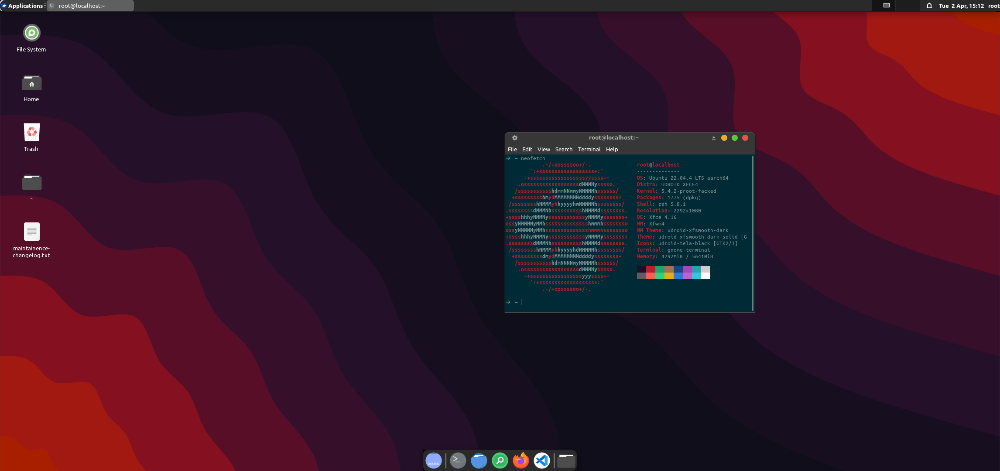

</div>
<p align="Center">

</p>


<!-- ! Description ") -->

<h2 align="Center">Linux on android</h2>

Linux-on-android is yet another utility allowing you to install pre-configured ubuntu with gui, development tools, and software on top of android without root via PRoot and Termux. 


codename = `Ldroid`

## Installation

**for fresh termux installation**

```bash
apt update && apt upgrade -y


```


## Showcase


**->** `ubuntu:xfce4`



> ### Contributing

Contributions are always welcome! We appreciate any type of contribution, not only code. For example, you can help the wiki shape up. Any changes to this repository/code should be submitted as a pull request, with well explained description.


## Licence

MIT
Copyright © 2024 lynux67

